# Smart Home Assistant — Complete Workflow

End-to-end description of every path a user request can take through the system, from input on a device to the final action and reply.

A single brain (`core.processor.process_transcript`) is shared by all entry points — Telegram bot, voice gateway (Raspberry Pi / ESP32), and direct HTTP — so behaviour is identical regardless of how the request arrives.

---

## Contents

1. [Interactive workflow diagram](#1-interactive-workflow-diagram)
2. [High-level flow (Mermaid)](#2-high-level-flow-mermaid)
3. [Layer-by-layer walkthrough](#3-layer-by-layer-walkthrough)
4. [Parameter influence summary](#4-parameter-influence-summary)
5. [Example traces](#5-example-traces)
6. [File / module map](#6-file--module-map)

---

## 1. Interactive workflow diagram

The full graphical workflow lives in **[WORKFLOW.drawio](WORKFLOW.drawio)** — a draw.io file with color‑coded swimlanes, decision branches, and full parameter details inside each box.

Open it with any of:

- **VS Code** → *Draw.io Integration* extension (`hediet.vscode-drawio`)
- **Browser** → drop the file into [app.diagrams.net](https://app.diagrams.net)
- **Desktop app** → [drawio-desktop](https://github.com/jgraph/drawio-desktop/releases)

Markdown can't embed `.drawio` natively. To embed it as a static image, open the file in draw.io and export as **SVG** or **PNG**, then reference it like ``.

The Mermaid diagram below is a simpler text‑rendered version that GitHub renders inline; the `.drawio` file is the authoritative version.

---

## 2. High-level flow (Mermaid)

```mermaid
flowchart TD
    %% =========================
    %% INPUT LAYER
    %% =========================
    subgraph IN["INPUT"]
        TG_TEXT["Telegram text"]
        TG_VOICE["Telegram voice"]
        RPI_AUDIO["RPi / ESP32<br/>POST /audio"]
        RPI_TEXT["RPi / ESP32<br/>POST /text"]
    end

    %% =========================
    %% TRANSPORT
    %% =========================
    TG_TEXT   --> H_TEXT["handlers.handle_text"]
    TG_VOICE  --> H_VOICE["handlers.handle_voice"]
    RPI_AUDIO --> GW_AUDIO["voice_gateway /audio"]
    RPI_TEXT  --> GW_TEXT["voice_gateway /text"]

    H_VOICE  --> STT["core.voice.transcribe_audio<br/>(local | external)"]
    GW_AUDIO --> STT
    STT      --> DISPATCH
    H_TEXT   --> DISPATCH
    GW_TEXT  --> DISPATCH

    %% =========================
    %% CORE BRAIN
    %% =========================
    DISPATCH(["core.processor.process_transcript<br/>(transcript, chat_id)"])

    DISPATCH --> SNAP["get_history_snapshot(chat_id)"]
    SNAP --> EMBQ{"RAG_QUERY_REWRITE ?"}

    EMBQ -- "true"  --> RW["rewriter.rewrite_query<br/>→ {intent, query}"]
    EMBQ -- "false" --> ENRICH["transcript ≤ 5 words ?<br/>prepend recent history<br/>else use transcript as-is<br/>(intent = 'command')"]

    RW --> INTENT{"intent ?"}
    INTENT -- "smalltalk / clarification" --> SMALL["smalltalk_reply<br/>(free German prose)"]
    SMALL --> RESULT[["result.reply<br/>actions = []"]]
    INTENT -- "command" --> RAGON
    ENRICH --> RAGON

    RAGON{"RAG_ENABLED ?"}
    RAGON -- "false" --> LEGACY["parse_command<br/>(entities.yaml)"]
    RAGON -- "true"  --> RAGQ["rag.index.query(embed_query)<br/>embed → KNN → keyword boost<br/>→ top-K candidates"]
    RAGQ -- "0 candidates" --> LEGACY

    RAGQ --> STATES["ha.get_states_bulk<br/>(parallel — all K candidates)"]
    STATES --> RAGP["parse_command_rag<br/>(transcript + candidates + live states)<br/>returns: reply, actions[],<br/>service_data?, clarification_question?"]

    RAGP --> CLAR{"clarification_question<br/>set & actions empty ?"}
    CLAR -- "yes" --> CLARIFY[["reply = clarification_question<br/>append_clarification_turn()<br/>actions = []"]]
    CLARIFY --> RESULT
    CLAR -- "no" --> CMD{"command result"}
    LEGACY --> CMD

    CMD -- "actions empty + FALLBACK_MODE=1"  --> RESTFB["get_all_states +<br/>parse_command_with_states"]
    CMD -- "actions empty + FALLBACK_MODE=2"  --> MCPFB["fallback_via_mcp<br/>(LM Studio + HA MCP)"]
    CMD -- "needs_fallback"                   --> FBROUTE{"FALLBACK_MODE ?"}
    FBROUTE -- "1" --> RESTFB
    FBROUTE -- "2" --> MCPFB
    FBROUTE -- "0" --> ERR_NM[["error: needs_fallback_no_mode"]]
    CMD -- "actions present" --> EXEC

    RESTFB --> EXEC
    MCPFB --> RESULT

    EXEC["For each action:<br/>ha.call_service(domain, action, entity_id, service_data?)<br/>enforce MAX_ACTIONS_PER_COMMAND"]
    EXEC --> APPEND{"HISTORY_APPEND_EXECUTIONS ?"}
    APPEND -- "yes" --> APPENDH["append_execution_summary"]
    APPENDH --> RESULT
    APPEND -- "no"  --> RESULT

    %% =========================
    %% OUTPUT LAYER
    %% =========================
    RESULT --> CALLER{"caller ?"}
    CALLER -- "Telegram" --> FMTREPLY["handlers._format_reply<br/>Markdown + ✅/❌"]
    FMTREPLY --> TG_OUT["📤 Telegram message"]

    CALLER -- "Gateway" --> TTS{"tts=true &<br/>TTS_EXTERNAL_URL set ?"}
    TTS -- "yes" --> WAV["_tts_to_wav → audio/wav"]
    TTS -- "no"  --> JSON["application/json"]
    CALLER -. "GATEWAY_TELEGRAM_PUSH" .-> PUSH["Telegram receipt to MY_CHAT_ID"]

    classDef inp  fill:#eef7ff,stroke:#3a78c2,color:#0a2540
    classDef proc fill:#fff8e1,stroke:#c69026,color:#3a2a00
    classDef llm  fill:#fdebf3,stroke:#b3206c,color:#3a0020
    classDef ha   fill:#e9f7e9,stroke:#3a8a3a,color:#0a3a0a
    classDef out  fill:#f3e9ff,stroke:#6a3ab2,color:#1a0a3a
    classDef err  fill:#ffe9e9,stroke:#c23a3a,color:#3a0a0a

    class TG_TEXT,TG_VOICE,RPI_AUDIO,RPI_TEXT inp
    class H_TEXT,H_VOICE,GW_AUDIO,GW_TEXT,STT,DISPATCH,SNAP,EMBQ,ENRICH,INTENT,RAGON,CLAR,CMD,FBROUTE,APPEND,CALLER,TTS proc
    class RW,SMALL,RAGQ,RAGP,LEGACY,RESTFB,MCPFB llm
    class STATES ha
    class EXEC,APPENDH ha
    class RESULT,FMTREPLY,TG_OUT,WAV,JSON,PUSH,CLARIFY out
    class ERR_NM err
```



---

## 3. Layer-by-layer walkthrough

### 3.1 Input

| Source | Entry point | Behaviour |
|---|---|---|
| Telegram text | `handlers.handle_text` | reads `update.message.text`, replies "🤖 Analysiere…", calls `_dispatch` |
| Telegram voice | `handlers.handle_voice` | downloads voice file → `core.voice.transcribe_audio` → `_dispatch` |
| RPi / ESP32 audio | `voice_gateway.audio_endpoint` | saves upload → `transcribe_audio` → `process_transcript` |
| RPi / ESP32 text | `voice_gateway.text_endpoint` | takes JSON `{text, device_id, tts}` → `process_transcript` |

The `chat_id` controls **conversation history**:

- Telegram: real chat ID.
- Gateway: `_device_to_chat_id(device_id)` — numeric IDs are reused (an RPi using the owner's Telegram chat ID *shares history* with Telegram); other strings hash into an isolated bucket.

### 3.2 Speech-to-text (voice only)

`core.voice.transcribe_audio(path)` switches on `WHISPER_BACKEND`:

- `local` — faster-whisper (`WHISPER_MODEL`, `WHISPER_DEVICE`, `WHISPER_COMPUTE_TYPE`, `WHISPER_THREADS`, `WHISPER_BEAM_SIZE`, `WHISPER_LANGUAGE`).
- `external` — HTTP POST to `WHISPER_EXTERNAL_URL` (`WHISPER_EXTERNAL_MODEL`).

Empty transcript returns the error reply early (Telegram: ❌ message; Gateway: `{"error": "no_speech"}`).

### 3.3 Core brain — embed query and intent

Two paths, depending on `RAG_QUERY_REWRITE`:

**A) Rewriter ON (`RAG_QUERY_REWRITE=true`)**

`core.rag.rewriter.rewrite_query(transcript, chat_id)` makes a small LLM call against `RAG_REWRITE_LLM_URL` / `RAG_REWRITE_MODEL` / `RAG_REWRITE_LLM_API_KEY` (each falls back to its `LMSTUDIO_*` equivalent), with `RAG_REWRITE_TEMPERATURE` and `RAG_REWRITE_TIMEOUT`. It returns:

```json
{"intent": "command|smalltalk|clarification", "query": "<normalized phrase>"}
```

The history block sent to the rewriter is built from `LLM_HISTORY_SIZE` past turns (assistant turns included when `HISTORY_INCLUDE_ASSISTANT=true`). On any error → safe default `{"intent": "command", "query": <original>}`.

**B) Rewriter OFF**

- Transcript ≤ 5 words → prepend recent history to the embed query (legacy short-follow-up handling).
- Otherwise → `embed_query = transcript`.
- Intent is always `"command"`.

**Intent routing:**

- `smalltalk` / `clarification` → `core.llm.smalltalk_reply()` produces free-form German prose; RAG is **skipped**, returned immediately.
- `command` → continue.

### 3.4 Entity retrieval

- `RAG_ENABLED=false` → legacy `parse_command()` against `core/entities.yaml`.
- `RAG_ENABLED=true` → `core.rag.index.query(embed_query)`:
  1. `embed_one()` against `RAG_EMBED_URL` / `RAG_EMBED_MODEL` (dim must match `RAG_EMBED_DIM`).
  2. KNN in `entity_vecs` (sqlite-vec) with `k = RAG_TOP_K`.
  3. Keyword boost — curated keywords appearing in transcript multiply distance by `(1 - RAG_KEYWORD_BOOST)`.
  4. Returns top-K candidates with `entity_id`, `friendly_name`, `domain`, `actions`, `meta`, `distance`.

### 3.5 State enrichment + Parser

Before the LLM call, `ha.get_states_bulk()` fetches the current HA state (including all relevant attributes) for all K candidates **in parallel**. Each entity line in the prompt therefore shows e.g.:

```
- sensor.plug_jbl_power | name: JBL Power | state: 10.39 W | actions: -
- switch.plug_jbl       | name: JBL Steckdose | state: an   | actions: turn_on, turn_off
- climate.pool          | name: Pool Heizung | state: heat | current_temperature=24.0, temperature=28.0, hvac_mode=heat | actions: set_temperature, set_hvac_mode
```

`core.llm.parse_command_rag(transcript, candidates, chat_id)` then runs the `rag_parser` prompt with this enriched entity list. Parameters:

- `LMSTUDIO_URL`, `LMSTUDIO_MODEL`, `LMSTUDIO_API_KEY`, `LMSTUDIO_TIMEOUT`
- `LMSTUDIO_TEMPERATURE`
- `LMSTUDIO_NO_THINK` (appends `no_think_suffix` to the prompt)
- `LLM_HISTORY_SIZE`, `HISTORY_INCLUDE_ASSISTANT` (history injected as chat messages)
- `MAX_ACTIONS_PER_COMMAND` (excess actions get marked `ignored=true`)

Because the LLM already has the live values, it can:
- **Answer state queries directly** in `reply` (no separate Step2 call needed)
- **Evaluate conditions** ("turn off if > 15 W" → checks state → acts or abstains)
- **Calculate parameters** ("5 degrees above outdoor temp" → reads both values → emits `service_data`)

Output JSON:

```json
{
  "reply": "...",
  "actions": [
    {"entity_id": "...", "action": "...", "domain": "...", "service_data": {...}}
  ],
  "clarification_question": "..."   // optional
}
```

`service_data` is forwarded verbatim to `ha.call_service` (e.g. `{"temperature": 23}` for `climate.set_temperature`).

Validation rules:

- Every `entity_id` must exist in the candidate list (or in `entities.yaml` for the legacy path); hallucinated IDs are dropped.
- `service_data` must be a dict; invalid values are stripped.
- `needs_fallback` is always allowed.

**Clarification (LLM-driven).** The parser itself decides when it cannot fulfil the request unambiguously with the supplied candidates. If it returns a non-empty `clarification_question` and no actions, the processor surfaces it directly:

- `result.reply = clarification_question`
- `result.actions_executed = []`
- `append_clarification_turn(chat_id, transcript, clarification_question)` writes the original transcript and the question into history, so the next user turn (the answer) lands with the original action intent intact.

There is no distance-based gate; the parser sees the transcript, the history, and the friendly names of all candidates, and is the right place to make this judgement.

### 3.6 Fallback paths

| Trigger | `FALLBACK_MODE=0` | `FALLBACK_MODE=1` | `FALLBACK_MODE=2` |
|---|---|---|---|
| Parser returned `actions=[]` | error `no_match` | `parse_command_with_states()` over live HA states (filter `FALLBACK_REST_DOMAINS`, cap `FALLBACK_REST_MAX_ENTITIES`) | `fallback_via_mcp()` calls LM Studio with the HA MCP server (whitelist `LMSTUDIO_MCP_ALLOWED_TOOLS`, context `LMSTUDIO_CONTEXT_LENGTH`) |
| Parser returned `needs_fallback` | error `needs_fallback_no_mode` | same as above | same as above |

The REST fallback uses the *prior* history snapshot so it doesn't see the just‑appended turn from the primary parser.

### 3.7 Action execution

For each validated action `core.ha.call_service(domain, action, entity_id, service_data)` is called. If the LLM returned `service_data` (e.g. `{"temperature": 23}` for `set_temperature`), it is merged into the HA service-call body.

`MAX_ACTIONS_PER_COMMAND > 0` enforces a per-command cap; surplus actions go into `actions_ignored`.

State queries ("wie warm ist der Pool?") are answered directly by the parser in `reply` using the live values from state enrichment — no separate HA call or second LLM pass happens.

### 3.8 History persistence

- Every parser/smalltalk call stores the user message in `_history[chat_id]` (capped by `LLM_HISTORY_SIZE`).
- Assistant turns are stored only when `HISTORY_INCLUDE_ASSISTANT=true`.
- When `HISTORY_APPEND_EXECUTIONS=true` (and assistant turns are stored), `append_execution_summary()` appends `"ausgefuehrt: <action> -> <entity>, …"` to the last assistant entry — this is what enables follow-ups like "und wieder aus" without RAG retrieval becoming too greedy.

### 3.9 Output

The processor returns a fixed dict:

```json
{
  "transcript": "…",
  "reply": "…",
  "actions_executed": [{"action": "...", "entity_id": "...", "success": true, "service_data": {...}}],
  "actions_ignored":  [{"action": "...", "entity_id": "..."}],
  "error": null,
  "fallback_used": null
}
```

`service_data` is only present in `actions_executed` entries when the LLM supplied parameters (e.g. `{"temperature": 23}`).

Possible `error` codes: `parse_failed`, `no_match`, `fallback_no_match`, `needs_fallback_no_mode`, `mcp_failed`, `smalltalk_failed`.
Possible `fallback_used`: `null`, `"rest"`, `"mcp"`.

Renderers:

- **Telegram** (`handlers._format_reply`) — Markdown message: `reply` plus ✅/❌ list of executed actions, ⚠️ list of ignored ones, or a localized error string.
- **Voice gateway** (`_reply_or_wav`):
  - `tts=true` + `TTS_EXTERNAL_URL` set → POSTs to TTS server, returns `audio/wav`.
  - otherwise → `application/json` with the full result dict.
  - if `GATEWAY_TELEGRAM_PUSH=true` → also sends a receipt to `MY_CHAT_ID` via the Telegram bot API.

---

## 4. Parameter influence summary

| Setting | Effect |
|---|---|
| `BOT_TOKEN`, `MY_CHAT_ID` | Telegram bot identity / receipt target for gateway pushes |
| `HA_URL`, `HA_TOKEN` | All `core.ha` calls (get_states_bulk, get_all_states, call_service) |
| `WHISPER_BACKEND` and friends | Local vs external STT |
| `LMSTUDIO_*` | Default LLM (parser, smalltalk, MCP fallback) |
| `LMSTUDIO_TEMPERATURE`, `LMSTUDIO_NO_THINK` | Determinism + `<think>`-tag suppression |
| `LMSTUDIO_MCP_ALLOWED_TOOLS`, `LMSTUDIO_CONTEXT_LENGTH` | MCP fallback (Mode 2) only |
| `LLM_HISTORY_SIZE` | How many turns are kept per chat (0 = no history) |
| `HISTORY_INCLUDE_ASSISTANT` | Whether the LLM remembers its own past replies |
| `HISTORY_APPEND_EXECUTIONS` | Whether HA actions are appended to the assistant turn (helps follow-ups) |
| `MAX_ACTIONS_PER_COMMAND` | Cap on actions per request (0 = unlimited) |
| `FALLBACK_MODE` | 0 off / 1 REST live-states / 2 LM Studio MCP |
| `FALLBACK_REST_DOMAINS`, `FALLBACK_REST_MAX_ENTITIES` | Filter for the REST fallback prompt size |
| `RAG_ENABLED` | Use vector retrieval instead of `entities.yaml` |
| `RAG_DB_PATH`, `RAG_TOP_K`, `RAG_KEYWORD_BOOST`, `RAG_EMBED_DIM` | Index location, retrieval depth, keyword bias, vector dim |
| `RAG_EMBED_URL/_API_KEY/_MODEL/_TIMEOUT` | Embedding service (defaults to `LMSTUDIO_*`) |
| `RAG_QUERY_REWRITE` | Enable rewriter + intent classification before RAG |
| `RAG_REWRITE_LLM_URL/_API_KEY/_MODEL/_TIMEOUT/_TEMPERATURE` | Where the rewriter call goes (defaults to `LMSTUDIO_*`) |
| `TTS_EXTERNAL_URL`, `TTS_EXTERNAL_VOICE` | If set, gateway returns synthesized WAV instead of JSON when `tts=true` |
| `GATEWAY_API_KEY`, `GATEWAY_PORT`, `GATEWAY_TELEGRAM_PUSH` | Voice gateway auth, port, push-receipt toggle |

> **Note.** Clarification is no longer threshold-based. The parser itself emits an optional `clarification_question` field when it is unsure, and the processor surfaces it. There are no `RAG_CLARIFY_*` settings.

---

## 5. Example traces

### 5.1 Telegram text "mach das licht bei paul an" (RAG + Rewriter ON)

1. `handle_text` → `_dispatch` → `process_transcript("mach das licht bei paul an", chat_id=12345)`.
2. `rewrite_query` → `{"intent":"command","query":"licht bei paul einschalten"}`.
3. `rag_query` → top-K with `light.licht_paul` in slot 1, `light.licht_max` in slot 2.
4. `parse_command_rag` → `{"reply":"okay, licht bei paul is an","actions":[{"entity_id":"light.licht_paul","action":"turn_on","domain":"light"}]}`.
5. `call_service("light","turn_on","light.licht_paul")` → success.
6. Telegram reply: `okay, licht bei paul is an\n\n✅ \`turn_on\` -> \`light.licht_paul\``.

### 5.2 Multi-entity "mach das licht bei max und paul an"

1. Rewriter (if on) → `query="licht bei max und paul einschalten"`.
2. RAG returns both `light.licht_max` and `light.licht_paul` near the top.
3. Parser sees both names in the transcript and emits two actions:
   ```json
   {"actions":[
     {"entity_id":"light.licht_max","action":"turn_on","domain":"light"},
     {"entity_id":"light.licht_paul","action":"turn_on","domain":"light"}
   ]}
   ```
4. Both actions run; Telegram shows two ✅ lines. No clarification is asked.

### 5.3 RPi voice "wie warm ist der pool" (RAG, voice → WAV)

1. `/audio` → `transcribe_audio()` → `"wie warm ist der pool"`.
2. `process_transcript`, `chat_id = _device_to_chat_id("rpi-wohnzimmer")`.
3. Rewriter (if on) → `{"intent":"command","query":"wassertemperatur pool"}`.
4. RAG returns `sensor.pool_temperature`.
5. `get_states_bulk(["sensor.pool_temperature"])` → `{"state": "26.4", "attributes": {"unit_of_measurement": "°C"}}`.
6. Parser sees `state: 26.4 °C` in the entity line → `{"reply":"Der Pool hat 26,4 °C.","actions":[]}`.
7. `tts=true` + TTS configured → WAV bytes streamed back to RPi.

No second LLM call. The answer is formed in the same pass as the entity matching.

### 5.4 Telegram "hi wie geht's?" (smalltalk routing)

1. `process_transcript` → rewriter → `{"intent":"smalltalk","query":"hi wie geht's"}`.
2. Skips RAG, calls `smalltalk_reply()` → `"hi! alles ruhig hier, was kann ich machen?"`.
3. Returned as `result.reply`, no actions, no errors.

### 5.5 Genuinely ambiguous "mach das licht aus" (parser-driven clarification)

1. RAG returns several lights as plausible candidates; transcript contains no disambiguator.
2. Parser cannot confidently pick one and emits:
   ```json
   {"reply":"", "actions":[], "clarification_question":"Welches Licht meinst du — Paul, Max oder Lisa?"}
   ```
3. Processor sets `result.reply = clarification_question`, leaves `actions_executed = []`, and calls `append_clarification_turn` so the original transcript and question stay in history.
4. User answers "paul". On the next turn the rewriter (or short-history enrichment) sees the previous turn's context → query becomes `"licht bei paul ausschalten"` → normal RAG path → action executes.

### 5.6 "schalte die JBL-Steckdose aus wenn sie mehr als 15 Watt verbraucht" (smart condition)

1. RAG returns `switch.plug_jbl`, `sensor.plug_jbl_power`, `binary_sensor.plug_jbl_overpowering`.
2. `get_states_bulk(...)` → `sensor.plug_jbl_power` state `"10.39"`, unit `"W"`.
3. Parser sees `state: 10.39 W` and evaluates the condition: 10.39 < 15 → no action:
   ```json
   {"reply":"Verbrauch liegt nur bei 10 W, also unter 15 W — ich lass sie an.","actions":[]}
   ```
4. No HA call. Reply spoken by RPi.

If the power had been 18 W the parser would emit `{"actions":[{"entity_id":"switch.plug_jbl","action":"turn_off","domain":"switch"}]}`.

### 5.7 "stell die Solltemperatur der Poolheizung 5 Grad über der Außentemperatur" (calculation + service_data)

1. RAG returns `climate.pool`, `sensor.aussentemperatur`.
2. `get_states_bulk(...)` → pool `current_temperature=24, temperature=28`, outdoor `state: "18.2 °C"`.
3. Parser calculates 18.2 + 5 = 23.2, rounds to 23:
   ```json
   {
     "reply": "Außen sind 18 °C, ich setze die Poolheizung auf 23 °C.",
     "actions": [{"entity_id":"climate.pool","action":"set_temperature","domain":"climate","service_data":{"temperature":23}}]
   }
   ```
4. `call_service("climate","set_temperature","climate.pool",{"temperature":23})` runs.

### 5.8 "stell die wohnzimmertemperatur auf 22°C" (needs_fallback → MCP)

1. Parser identifies `climate.wohnzimmer` but can't determine the correct service parameter from context → emits `action="needs_fallback"`.
2. `FALLBACK_MODE=2` → `fallback_via_mcp(transcript)` calls LM Studio with the HA MCP server.
3. MCP tool `HassClimateSetTemperature` runs and returns success.
4. Reply text from MCP becomes `result.reply`; `fallback_used="mcp"`.

---

## 6. File / module map

| Path | Role |
|---|---|
| [assistant/services/telegram_bot/bot/handlers.py](assistant/services/telegram_bot/bot/handlers.py) | Telegram entry: text/voice handlers, message formatting |
| [assistant/services/voice_gateway/main.py](assistant/services/voice_gateway/main.py) | FastAPI gateway for RPi/ESP32, TTS routing, Telegram receipt push |
| [assistant/core/voice.py](assistant/core/voice.py) | Whisper STT (local + external) |
| [assistant/core/processor.py](assistant/core/processor.py) | The shared brain — orchestrates everything |
| [assistant/core/rag/rewriter.py](assistant/core/rag/rewriter.py) | Pre-RAG: intent classification + query normalization |
| [assistant/core/rag/index.py](assistant/core/rag/index.py) | Build / query the entity vector index |
| [assistant/core/rag/embeddings.py](assistant/core/rag/embeddings.py) | Embedding HTTP client (LM Studio) |
| [assistant/core/rag/store.py](assistant/core/rag/store.py) | sqlite-vec persistence for vectors |
| [assistant/core/llm.py](assistant/core/llm.py) | All LLM calls: parser (legacy + RAG with live states), REST fallback, smalltalk, clarification |
| [assistant/core/llm_lmstudio.py](assistant/core/llm_lmstudio.py) | LM Studio MCP fallback (Mode 2) |
| [assistant/core/ha.py](assistant/core/ha.py) | Home Assistant REST client (get_states_bulk, call_service with service_data, get_all_states) |
| [assistant/core/prompts.yaml](assistant/core/prompts.yaml) | All system prompts (parser, RAG parser with state context, REST fallback, query rewriter, smalltalk) |
| [assistant/core/entities.yaml](assistant/core/entities.yaml) | Curated entities (legacy + RAG keyword/meta source) |
| [assistant/core/config.py](assistant/core/config.py) | All env-driven settings |
