# Smart Home Assistant — Complete Workflow

This document describes every path a user request can take through the system, from input on a device to the final action and reply.

The same brain (`core.processor.process_transcript`) is used by all entry points — Telegram bot, voice gateway (Raspberry Pi / ESP32), and direct HTTP — so behaviour is identical regardless of how the request arrives.

---

## 📐 Interactive workflow diagram

The full graphical workflow lives in **[WORKFLOW.drawio](WORKFLOW.drawio)** — a draw.io file showing every possible path with color-coded swimlanes, decision branches, and full parameter details inside each box.

Open it with any of:
- **VS Code** → install the *Draw.io Integration* extension (`hediet.vscode-drawio`) and click the file
- **Browser** → drop the file into [app.diagrams.net](https://app.diagrams.net)
- **Desktop app** → [drawio-desktop](https://github.com/jgraph/drawio-desktop/releases)

> Markdown can't embed `.drawio` natively. To embed it as a static image instead, open the file in draw.io and export as **SVG** or **PNG**, save it next to this Markdown, then reference it like:
> ``

The Mermaid diagram below is a simpler text-rendered version that GitHub renders inline; the `.drawio` file is the authoritative, professional version.

---

## 1. High-level diagram (Mermaid — quick view)

```mermaid
flowchart TD
    %% =========================
    %% INPUTS
    %% =========================
    subgraph IN["INPUT LAYER"]
        TG_TEXT["Telegram text message"]
        TG_VOICE["Telegram voice message"]
        RPI_AUDIO["Raspberry Pi / ESP32<br/>POST /audio (WAV/OGG/MP3)"]
        RPI_TEXT["Raspberry Pi / ESP32<br/>POST /text (JSON)"]
    end

    %% =========================
    %% TRANSPORT
    %% =========================
    TG_TEXT --> H_TEXT["handlers.handle_text<br/>(telegram_bot)"]
    TG_VOICE --> H_VOICE["handlers.handle_voice<br/>downloads .ogg<br/>+ shows '🎙️ Transkribiere…'"]
    RPI_AUDIO --> GW_AUDIO["voice_gateway /audio<br/>(FastAPI)"]
    RPI_TEXT --> GW_TEXT["voice_gateway /text<br/>(FastAPI)"]

    H_VOICE --> STT_LOCAL["core.voice.transcribe_audio()<br/>WHISPER_BACKEND=local|external"]
    GW_AUDIO --> STT_LOCAL
    STT_LOCAL --> H_VOICE_T["transcript: str"]
    H_TEXT --> H_TEXT_T["transcript: str"]
    GW_TEXT --> GW_TEXT_T["transcript: str"]
    H_VOICE_T --> DISPATCH
    H_TEXT_T --> DISPATCH
    GW_AUDIO_T(["chat_id = _device_to_chat_id(device_id)<br/>numeric → reuse | other → hash"]) --> DISPATCH
    H_VOICE_T -. chat_id = telegram chat_id .-> DISPATCH
    H_TEXT_T -. chat_id = telegram chat_id .-> DISPATCH
    GW_TEXT_T --> GW_AUDIO_T

    %% =========================
    %% CORE BRAIN
    %% =========================
    DISPATCH(["core.processor.process_transcript(<br/>transcript, chat_id)"])

    DISPATCH --> SNAP["get_history_snapshot(chat_id)<br/>(snapshot for REST fallback)"]
    SNAP --> EMBQ

    EMBQ{"RAG_QUERY_REWRITE<br/>== true ?"}
    EMBQ -- "yes" --> RW["core.rag.rewriter.rewrite_query(<br/>transcript, chat_id)<br/>→ {intent, query}"]
    EMBQ -- "no" --> ENRICH["short transcript ≤5 words?<br/>→ prepend recent history<br/>else: embed_query = transcript"]

    RW --> INTENT{"intent ?"}
    INTENT -- "smalltalk / clarification" --> SMALL["core.llm.smalltalk_reply(<br/>transcript, chat_id)<br/>(free German prose, no JSON)"]
    SMALL --> RESULT[["result.reply<br/>actions=[ ]"]]
    INTENT -- "command" --> RAGON

    ENRICH --> RAGON
    RAGON{"RAG_ENABLED ?"}
    RAGON -- "no" --> LEGACY["core.llm.parse_command(<br/>transcript, chat_id)<br/>(uses entities.yaml)"]
    RAGON -- "yes" --> RAGQ["core.rag.index.query(embed_query)<br/>1) embed_one() (LM Studio)<br/>2) sqlite-vec KNN search<br/>3) keyword boost<br/>→ top RAG_TOP_K + distances"]

    RAGQ --> CONF{"clarification gap < threshold ?<br/>(top2.distance - top1.distance)"}
    CONF -- "yes" --> CLARIFY[["reply: 'Meinst du X oder Y?'<br/>actions=[ ]"]]
    CONF -- "no, candidates exist" --> RAGP["core.llm.parse_command_rag(<br/>transcript, candidates, chat_id)"]
    CONF -- "no candidates" --> LEGACY

    RAGP --> CMD{"command result"}
    LEGACY --> CMD

    CMD -- "actions empty +<br/>FALLBACK_MODE=1" --> RESTFB["core.ha.get_all_states()<br/>+ parse_command_with_states()"]
    CMD -- "actions empty +<br/>FALLBACK_MODE=2" --> MCPFB["core.llm_lmstudio.fallback_via_mcp()<br/>(LM Studio + HA MCP server)"]
    CMD -- "needs_fallback action" --> FBROUTE{"FALLBACK_MODE ?"}
    FBROUTE -- "1" --> RESTFB
    FBROUTE -- "2" --> MCPFB
    FBROUTE -- "0" --> ERR_NM[["error: needs_fallback_no_mode"]]
    CMD -- "actions present" --> EXEC

    RESTFB --> EXEC
    MCPFB --> RESULT

    EXEC["For each action:<br/>• get_state → core.ha.get_state()<br/>• turn_on / turn_off / toggle / trigger →<br/>  core.ha.call_service(domain, action, entity_id)<br/>+ enforce MAX_ACTIONS_PER_COMMAND"]
    EXEC --> STATEQ{"any get_state results ?"}
    STATEQ -- "yes" --> FMT["core.llm.format_state_reply()<br/>(2nd LLM call: live data → German sentence)"]
    STATEQ -- "no" --> RESULT
    FMT --> RESULT
    EXEC --> APPEND{"HISTORY_APPEND_EXECUTIONS ?"}
    APPEND -- "yes" --> APPENDH["append_execution_summary(chat_id)"]
    APPENDH --> RESULT
    APPEND -- "no" --> RESULT

    %% =========================
    %% OUTPUT
    %% =========================
    RESULT --> OUT_TG{"caller = Telegram?"}
    RESULT --> OUT_GW{"caller = voice_gateway?"}
    OUT_TG -- "yes" --> FMTREPLY["handlers._format_reply()<br/>Markdown: reply + ✅/❌ actions"]
    FMTREPLY --> TG_OUT["Telegram message"]

    OUT_GW -- "tts=true + TTS_EXTERNAL_URL set" --> TTSCALL["_tts_to_wav() → tts_server"]
    TTSCALL --> RPI_OUT_WAV["audio/wav response"]
    OUT_GW -- "tts=false / TTS missing" --> RPI_OUT_JSON["application/json response"]
    OUT_GW --> TG_PUSH{"GATEWAY_TELEGRAM_PUSH<br/>== true ?"}
    TG_PUSH -- "yes" --> TG_OUT2["Telegram receipt to MY_CHAT_ID"]

    classDef inp fill:#eef7ff,stroke:#3a78c2,color:#0a2540
    classDef proc fill:#fff8e1,stroke:#c69026,color:#3a2a00
    classDef llm fill:#fdebf3,stroke:#b3206c,color:#3a0020
    classDef ha fill:#e9f7e9,stroke:#3a8a3a,color:#0a3a0a
    classDef out fill:#f3e9ff,stroke:#6a3ab2,color:#1a0a3a
    classDef err fill:#ffe9e9,stroke:#c23a3a,color:#3a0a0a

    class TG_TEXT,TG_VOICE,RPI_AUDIO,RPI_TEXT inp
    class H_TEXT,H_VOICE,GW_AUDIO,GW_TEXT,STT_LOCAL,DISPATCH,SNAP,EMBQ,ENRICH,INTENT,RAGON,CONF,CMD,FBROUTE,STATEQ,APPEND,OUT_TG,OUT_GW,TG_PUSH proc
    class RW,SMALL,RAGQ,RAGP,LEGACY,RESTFB,MCPFB,FMT llm
    class EXEC,APPENDH ha
    class RESULT,FMTREPLY,TG_OUT,RPI_OUT_WAV,RPI_OUT_JSON,TG_OUT2 out
    class CLARIFY,ERR_NM err
```



---

## 2. Layer-by-layer walkthrough

### Layer 1 — Input

| Source | Entry point | What happens |
|---|---|---|
| Telegram text | `handlers.handle_text` | reads `update.message.text`, replies "🤖 Analysiere…", calls `_dispatch` |
| Telegram voice | `handlers.handle_voice` | downloads voice file → `core.voice.transcribe_audio` → `_dispatch` |
| RPi / ESP32 audio | `voice_gateway.audio_endpoint` | saves upload → `transcribe_audio` → `process_transcript` |
| RPi / ESP32 text | `voice_gateway.text_endpoint` | takes JSON `{"text", "device_id", "tts"}` → `process_transcript` |

The `chat_id` carried into `process_transcript` controls **conversation history**:
- Telegram: real chat ID
- Gateway: `_device_to_chat_id(device_id)` — numeric IDs are reused (so an RPi with the owner's Telegram chat ID *shares history* with Telegram); other strings are hashed into an isolated history bucket.

### Layer 2 — Speech-to-text (voice only)

`core.voice.transcribe_audio(path)` — switches on `WHISPER_BACKEND`:
- `local`: faster-whisper (params `WHISPER_MODEL`, `WHISPER_DEVICE`, `WHISPER_COMPUTE_TYPE`, `WHISPER_THREADS`, `WHISPER_BEAM_SIZE`, `WHISPER_LANGUAGE`)
- `external`: HTTP POST to `WHISPER_EXTERNAL_URL` with `WHISPER_EXTERNAL_MODEL`

Empty transcript → returns the error reply early (Telegram: ❌ message; Gateway: `{"error": "no_speech"}`).

### Layer 3 — Core brain (`core.processor.process_transcript`)

#### 3.1 Build the embed query / classify intent

Two paths depending on `RAG_QUERY_REWRITE`:

**A) Rewriter ON (`RAG_QUERY_REWRITE=true`)**
- `core.rag.rewriter.rewrite_query(transcript, chat_id)` makes a small LLM call to:
  - `RAG_REWRITE_LLM_URL` / `RAG_REWRITE_MODEL` / `RAG_REWRITE_LLM_API_KEY` (each falls back to the matching `LMSTUDIO_*` if empty)
  - temperature `RAG_REWRITE_TEMPERATURE`, timeout `RAG_REWRITE_TIMEOUT`
- Receives JSON `{"intent": "command|smalltalk|clarification", "query": "<normalized phrase>"}`
- The history block sent to the rewriter LLM is built from `LLM_HISTORY_SIZE` past turns (and assistant turns when `HISTORY_INCLUDE_ASSISTANT=true`)
- On any error → safe default `{"intent": "command", "query": <original>}`

**B) Rewriter OFF**
- If transcript is ≤5 words → prepend recent history to the embed query (legacy behaviour for short follow-ups like "und wieder aus")
- Otherwise → embed query = original transcript
- Intent is always `"command"`

#### 3.2 Intent routing

- `intent == "smalltalk" | "clarification"` → call `core.llm.smalltalk_reply()` — free-form German chat, history-aware, no JSON, no actions. Result is returned immediately, RAG is **skipped**.
- `intent == "command"` → continue.

#### 3.3 Entity retrieval

- `RAG_ENABLED=false` → legacy `core.llm.parse_command()` using `core/entities.yaml`
- `RAG_ENABLED=true` → `core.rag.index.query(embed_query)`:
  1. `embed_one()` against `RAG_EMBED_URL` / `RAG_EMBED_MODEL` (dim must match `RAG_EMBED_DIM`)
  2. KNN in `entity_vecs` (sqlite-vec) with `k = RAG_TOP_K`
  3. Keyword boost — curated keywords appearing in transcript multiply distance by `(1 - RAG_KEYWORD_BOOST)`
  4. Returns top-K candidates with `entity_id`, `friendly_name`, `domain`, `actions`, `meta`, `distance`

#### 3.4 Confidence-based clarification

`_build_clarification(rag_entities)`:
- Always logs `top1`, `top2`, distances, gap, threshold, same-domain flag
- If `RAG_CLARIFY_GAP_THRESHOLD > 0` and `(d2 - d1) < threshold` and (optionally) same domain → return `"Meinst du <name1> oder <name2>?"` instead of guessing

#### 3.5 Parser (command interpretation)

- `core.llm.parse_command_rag(transcript, candidates, chat_id)` — system prompt = `rag_parser` from `prompts.yaml` with the candidate list injected. Parameters used:
  - `LMSTUDIO_URL`, `LMSTUDIO_MODEL`, `LMSTUDIO_API_KEY`, `LMSTUDIO_TIMEOUT`
  - `LMSTUDIO_TEMPERATURE`
  - `LMSTUDIO_NO_THINK` (appends "no_think_suffix" to the prompt)
  - `LLM_HISTORY_SIZE`, `HISTORY_INCLUDE_ASSISTANT` (history injected as chat messages between system and user message)
  - `MAX_ACTIONS_PER_COMMAND` (excess actions get marked `ignored=true`)
- Returns `{"reply": "...", "actions": [{"entity_id", "action", "domain"}, ...]}`
- Validates that every `entity_id` exists in the candidate list; hallucinated IDs are dropped. `needs_fallback` is always allowed.

#### 3.6 Fallback paths

| Trigger | `FALLBACK_MODE=0` | `FALLBACK_MODE=1` | `FALLBACK_MODE=2` |
|---|---|---|---|
| Parser returned `actions=[]` | error `no_match` | `parse_command_with_states()` over live HA states (filtered by `FALLBACK_REST_DOMAINS`, capped at `FALLBACK_REST_MAX_ENTITIES`) | `fallback_via_mcp()` calls LM Studio with the MCP server (whitelist `LMSTUDIO_MCP_ALLOWED_TOOLS`, context `LMSTUDIO_CONTEXT_LENGTH`) |
| Parser returned `needs_fallback` | error `needs_fallback_no_mode` | same as above | same as above |

REST fallback uses the *prior* history snapshot so it doesn't see the just-appended turn from the primary parser.

#### 3.7 Action execution

For each validated action:
- `action == "get_state"` → `core.ha.get_state(entity_id)`; record into `state_queries` for the post-formatter
- otherwise → `core.ha.call_service(domain, action, entity_id)`
- If `MAX_ACTIONS_PER_COMMAND > 0` enforces a per-command cap; surplus go into `actions_ignored`.

#### 3.8 State formatter (only if any `get_state` ran)

`core.llm.format_state_reply()` — second LLM call using `state_formatter` system prompt. Turns raw HA values into a single natural German sentence and replaces `result["reply"]`.

#### 3.9 History persistence

- After every parser/smalltalk call: user message stored in `_history[chat_id]` (size capped by `LLM_HISTORY_SIZE`)
- Assistant turn stored only if `HISTORY_INCLUDE_ASSISTANT=true`
- If `HISTORY_APPEND_EXECUTIONS=true` (and assistant turns are stored), `append_execution_summary()` appends `"ausgefuehrt: <action> -> <entity>, …"` to the last assistant entry — this is what enables follow-ups like "und wieder aus" to work without RAG retrieval being too greedy.

### Layer 4 — Output

The processor's return value is a fixed dict:

```json
{
  "transcript": "…",
  "reply": "…",
  "actions_executed": [{"action": "...", "entity_id": "...", "success": true}],
  "actions_ignored":  [{"action": "...", "entity_id": "..."}],
  "error": null | "parse_failed" | "no_match" | "fallback_no_match" |
           "needs_fallback_no_mode" | "mcp_failed" | "smalltalk_failed",
  "fallback_used": null | "rest" | "mcp"
}
```

Each caller renders it differently:

- **Telegram** (`handlers._format_reply`) → Markdown message (`reply` + ✅/❌ list of executed actions, ⚠️ list of ignored ones, or a localized error string)
- **Voice gateway** (`_reply_or_wav`):
  - `tts=true` + `TTS_EXTERNAL_URL` configured → POSTs to TTS server, returns `audio/wav`
  - otherwise → `application/json` with the full result dict
  - if `GATEWAY_TELEGRAM_PUSH=true` → also sends a receipt to `MY_CHAT_ID` over the Telegram bot API

---

## 3. Parameter influence summary

| Setting | Effect |
|---|---|
| `BOT_TOKEN`, `MY_CHAT_ID` | Telegram bot identity / receipt target for gateway pushes |
| `HA_URL`, `HA_TOKEN` | All `core.ha` calls (get_state, get_all_states, call_service) |
| `WHISPER_BACKEND` and friends | Local vs external STT |
| `LMSTUDIO_*` | Default LLM (parser, smalltalk, state-formatter, MCP) |
| `LMSTUDIO_TEMPERATURE`, `LMSTUDIO_NO_THINK` | Determinism + `<think>`-tag suppression |
| `LMSTUDIO_MCP_ALLOWED_TOOLS`, `LMSTUDIO_CONTEXT_LENGTH` | MCP fallback (Mode 2) only |
| `LLM_HISTORY_SIZE` | How many turns are kept per chat (0 = no history) |
| `HISTORY_INCLUDE_ASSISTANT` | Whether the LLM remembers its own past replies |
| `HISTORY_APPEND_EXECUTIONS` | Whether HA actions are appended to the assistant turn (helps follow-ups) |
| `MAX_ACTIONS_PER_COMMAND` | Cap on actions per request (0 = unlimited) |
| `FALLBACK_MODE` | 0 off / 1 REST live-states / 2 LM Studio MCP |
| `FALLBACK_REST_DOMAINS`, `FALLBACK_REST_MAX_ENTITIES` | Filter for the REST fallback prompt size |
| `RAG_ENABLED` | Use vector retrieval instead of `entities.yaml` |
| `RAG_DB_PATH`, `RAG_TOP_K`, `RAG_KEYWORD_BOOST`, `RAG_EMBED_DIM` | Index location, retrieval depth, keyword bias, vector dim |
| `RAG_EMBED_URL/_API_KEY/_MODEL/_TIMEOUT` | Embedding service (defaults to LMSTUDIO_*) |
| `RAG_QUERY_REWRITE` | Enable rewriter + intent classification before RAG |
| `RAG_REWRITE_LLM_URL/_API_KEY/_MODEL/_TIMEOUT/_TEMPERATURE` | Where the rewriter call goes (defaults to LMSTUDIO_*) |
| `RAG_CLARIFY_GAP_THRESHOLD` | Distance gap below which the assistant asks "X oder Y?" |
| `RAG_CLARIFY_SAME_DOMAIN_ONLY` | Restrict clarification to candidates of the same HA domain |
| `TTS_EXTERNAL_URL`, `TTS_EXTERNAL_VOICE` | If set, gateway returns synthesized WAV instead of JSON when `tts=true` |
| `GATEWAY_API_KEY`, `GATEWAY_PORT`, `GATEWAY_TELEGRAM_PUSH` | Voice gateway auth, port, push receipt toggle |

---

## 4. Five concrete example traces

### 4.1 Telegram text "mach das licht bei paul an" (RAG + Rewriter ON)

1. `handle_text` → `_dispatch` → `process_transcript("mach das licht bei paul an", chat_id=12345)`
2. `rewrite_query` → `{"intent":"command","query":"licht bei paul einschalten"}`
3. `rag_query("licht bei paul einschalten")` → top-15 with `light.licht_paul` in slot 1 (`d=0.12`), `light.licht_max` in slot 2 (`d=0.31`)
4. Confidence log: `gap=0.19, threshold=0.05` → no clarification
5. `parse_command_rag` → `{"reply":"okay, licht bei paul is an","actions":[{"entity_id":"light.licht_paul","action":"turn_on","domain":"light"}]}`
6. `call_service("light","turn_on","light.licht_paul")` → success
7. Telegram reply: `okay, licht bei paul is an\n\n✅ \`turn_on\` -> \`light.licht_paul\``

### 4.2 RPi voice "wie warm ist der pool" (RAG, voice → WAV)

1. `/audio` → `transcribe_audio()` → `"wie warm ist der pool"`
2. `process_transcript`, `chat_id = _device_to_chat_id("rpi-wohnzimmer")`
3. Rewriter (if on) → `{"intent":"command","query":"wassertemperatur pool"}`
4. RAG returns `sensor.pool_temperature`
5. Parser → `{"actions":[{"entity_id":"sensor.pool_temperature","action":"get_state","domain":"sensor"}]}`
6. `get_state()` → `26.4 °C`
7. `format_state_reply` (2nd LLM call) → `"der pool hat 26 grad"`
8. `tts=true` + TTS configured → WAV bytes streamed back to RPi

### 4.3 Telegram "hi wie geht's?" (smalltalk routing)

1. `process_transcript` → rewriter → `{"intent":"smalltalk","query":"hi wie geht's"}`
2. Skips RAG, calls `smalltalk_reply()` → `"hi! alles ruhig hier, was kann ich machen?"`
3. Returned as `result.reply`, no actions, no errors.

### 4.4 Ambiguous "mach das licht aus" (clarification)

1. RAG returns `light.licht_paul` (`d=0.18`) and `light.licht_max` (`d=0.20`) — same domain.
2. `RAG_CLARIFY_GAP_THRESHOLD=0.05`. Gap = 0.02 → triggers clarification.
3. Parser is skipped. Reply: `"Meinst du Paul oder Max?"`
4. User answers "paul". On the next turn the rewriter sees the previous assistant clarification + user "paul" in history → produces `query="licht bei paul ausschalten"` → normal RAG path.

### 4.5 "stell die wohnzimmertemperatur auf 22°C" (needs_fallback → MCP)

1. Parser identifies `climate.wohnzimmer` but emits `action="needs_fallback"` (parametric).
2. `FALLBACK_MODE=2` → `fallback_via_mcp(transcript)` calls LM Studio with HA MCP server.
3. MCP tool `HassClimateSetTemperature` runs and returns success.
4. Reply text from MCP is set as `result.reply`, `fallback_used="mcp"`.

---

## 5. File / module map

| Path | Role |
|---|---|
| [assistant/services/telegram_bot/bot/handlers.py](assistant/services/telegram_bot/bot/handlers.py) | Telegram entry: text/voice handlers, message formatting |
| [assistant/services/voice_gateway/main.py](assistant/services/voice_gateway/main.py) | FastAPI gateway for RPi/ESP32, TTS routing, Telegram receipt push |
| [assistant/core/voice.py](assistant/core/voice.py) | Whisper STT (local + external) |
| [assistant/core/processor.py](assistant/core/processor.py) | The shared brain — orchestrates everything |
| [assistant/core/rag/rewriter.py](assistant/core/rag/rewriter.py) | Pre-RAG: intent classification + query normalization |
| [assistant/core/rag/index.py](assistant/core/rag/index.py) | Build/query the entity vector index |
| [assistant/core/rag/embeddings.py](assistant/core/rag/embeddings.py) | Embedding HTTP client (LM Studio) |
| [assistant/core/rag/store.py](assistant/core/rag/store.py) | sqlite-vec persistence for vectors |
| [assistant/core/llm.py](assistant/core/llm.py) | All LLM calls: parser (legacy + RAG), state formatter, smalltalk |
| [assistant/core/llm_lmstudio.py](assistant/core/llm_lmstudio.py) | LM Studio MCP fallback (Mode 2) |
| [assistant/core/ha.py](assistant/core/ha.py) | Home Assistant REST client (get_state, call_service, …) |
| [assistant/core/prompts.yaml](assistant/core/prompts.yaml) | All system prompts (parser, RAG parser, REST fallback, state formatter, query rewriter, smalltalk) |
| [assistant/core/entities.yaml](assistant/core/entities.yaml) | Curated entities (legacy + RAG keyword/meta source) |
| [assistant/core/config.py](assistant/core/config.py) | All env-driven settings |
