# Smart Home Assistant — Architecture & Workflow

> This file supersedes `ARCHITECTURE.md` and `WORKFLOW.md`.

A single brain (`core.processor.process_transcript`) is shared by all entry points — Telegram bot, voice gateway (Raspberry Pi / ESP32), and direct HTTP — so LLM, RAG, fallback, and history behaviour is identical regardless of how the request arrives.

Telegram button/menu actions bypass the brain entirely: they call Home Assistant directly and are configured purely in `menus.yaml`.

---

## Contents

1. [Folder layout](#1-folder-layout)
2. [Dependency rules](#2-dependency-rules)
3. [High-level flow (Mermaid)](#3-high-level-flow-mermaid)
4. [Layer-by-layer walkthrough](#4-layer-by-layer-walkthrough)
5. [Parameter influence summary](#5-parameter-influence-summary)
6. [Example traces](#6-example-traces)
7. [File / module map](#7-file--module-map)
8. [Running the services](#8-running-the-services)
9. [Extending](#9-extending)

---

## 1. Folder layout

```
hass-ai-gateway/
├── gateway/
│   ├── core/                          ← framework-agnostic command logic
│   │   ├── processor.py               ── single source of truth (transcript → actions)
│   │   ├── config.py                  ── .env loader + all settings
│   │   ├── llm.py                     ── LM Studio client: parse_command / parse_command_rag / …
│   │   ├── llm_lmstudio.py            ── MCP fallback (Mode 2)
│   │   ├── ha.py                      ── Home Assistant REST client
│   │   ├── voice.py                   ── Whisper transcription (local or external)
│   │   ├── entities.yaml              ── curated entity catalogue
│   │   └── rag/                       ── embeddings, sqlite-vec store, index, rewriter
│   │
│   ├── services/
│   │   ├── telegram_bot/              ← Telegram adapter
│   │   │   ├── main.py                ── entry point; registers all handlers from menus.yaml
│   │   │   ├── menus.yaml             ── ALL button/menu config (no code needed to change menus)
│   │   │   └── bot/
│   │   │       ├── menu_config.py     ── loads & parses menus.yaml
│   │   │       ├── menu.py            ── reply-keyboard helpers, startup menu
│   │   │       ├── callbacks.py       ── menu + inline-button handlers, HA action dispatch
│   │   │       └── handlers.py        ── voice/text → core.processor → Telegram Markdown
│   │   │
│   │   ├── voice_gateway/             ← HTTP adapter (FastAPI)
│   │   │   ├── main.py                ── /audio, /text, /health endpoints
│   │   │   └── requirements.txt
│   │   │
│   │   ├── faster_whisper/            ← optional external Whisper server
│   │   └── tts_server/                ← optional TTS server
│   │
│   └── devices/
│       └── raspberry_pi/              ← on-device client
│           ├── voice_client.py        ── openWakeWord → record → POST → TTS
│           └── requirements.txt
│
├── addon/                             ← HA Supervisor add-on packaging
└── docs/                              ← architecture, overview, workflow
```

---

## 2. Dependency rules

```
      ┌─────────────────────────────────────────────┐
      │                   core/                     │  ← knows about nothing else
      │  processor → llm / ha / voice / config      │
      └────────────▲─────────────────▲──────────────┘
                   │                 │
      ┌────────────┴──────────┐  ┌───┴──────────────────┐
      │ services/telegram_bot │  │ services/voice_gateway│  ← adapters, depend only on core/
      └───────────────────────┘  └──────────────────────┘
                                            ▲
                                            │ HTTP
                                 ┌──────────┴──────────┐
                                 │  devices/raspberry_pi│  ← dumb edge device
                                 └─────────────────────┘
```

- `core/` **never** imports from `services/` or `devices/`.
- `services/telegram_bot/` imports from `core/` but not from `services/voice_gateway/`.
- `services/voice_gateway/` imports from `core/` but not from `services/telegram_bot/`.
- Devices talk to the gateway over HTTP only — no shared code.

---

## 3. High-level flow (Mermaid)

Two distinct paths exist in the Telegram bot: **button/menu actions** (direct HA call, no LLM) and **voice/text commands** (full core pipeline).

```mermaid
flowchart TD
    %% =========================
    %% INPUT LAYER
    %% =========================
    subgraph IN["INPUT"]
        TG_BTN["Telegram inline button\n(menus.yaml)"]
        TG_TEXT["Telegram text"]
        TG_VOICE["Telegram voice"]
        RPI_AUDIO["RPi / ESP32\nPOST /audio"]
        RPI_TEXT["RPi / ESP32\nPOST /text"]
    end

    %% =========================
    %% TELEGRAM BUTTON PATH (no LLM)
    %% =========================
    TG_BTN --> YAML["callbacks.action_callback\nlooks up automation/service\nfrom menus.yaml"]
    YAML --> HA_DIRECT["core.ha.trigger_automation\nor call_service"]
    HA_DIRECT --> BTN_REPLY["📤 edit_message_text\n(response from menus.yaml)"]

    %% =========================
    %% VOICE / TEXT PATH
    %% =========================
    TG_TEXT   --> H_TEXT["handlers.handle_text"]
    TG_VOICE  --> H_VOICE["handlers.handle_voice"]
    RPI_AUDIO --> GW_AUDIO["voice_gateway /audio"]
    RPI_TEXT  --> GW_TEXT["voice_gateway /text"]

    H_VOICE  --> STT["core.voice.transcribe_audio\n(local | external)"]
    GW_AUDIO --> STT
    STT      --> DISPATCH
    H_TEXT   --> DISPATCH
    GW_TEXT  --> DISPATCH

    %% =========================
    %% CORE BRAIN
    %% =========================
    DISPATCH(["core.processor.process_transcript\n(transcript, chat_id)"])

    DISPATCH --> SNAP["get_history_snapshot(chat_id)"]
    SNAP --> EMBQ{"RAG_QUERY_REWRITE ?"}

    EMBQ -- "true"  --> RW["rewriter.rewrite_query\n→ {intent, query}"]
    EMBQ -- "false" --> ENRICH["transcript ≤ 5 words ?\nprepend recent history\nelse use transcript as-is\n(intent = 'command')"]

    RW --> INTENT{"intent ?"}
    INTENT -- "smalltalk / clarification" --> SMALL["smalltalk_reply\n(free German prose)"]
    SMALL --> RESULT[["result.reply\nactions = []"]]
    INTENT -- "command" --> RAGON
    ENRICH --> RAGON

    RAGON{"RAG_ENABLED ?"}
    RAGON -- "false" --> LEGACY["parse_command\n(entities.yaml)"]
    RAGON -- "true"  --> RAGQ["rag.index.query(embed_query)\nembed → KNN → keyword boost\n→ top-K candidates"]
    RAGQ -- "0 candidates" --> LEGACY

    RAGQ --> RAGP["parse_command_rag\n(transcript + candidates)\nreturns: reply, actions[],\nclarification_question?"]

    RAGP --> CLAR{"clarification_question\nset & actions empty ?"}
    CLAR -- "yes" --> CLARIFY[["reply = clarification_question\nappend_clarification_turn()\nactions = []"]]
    CLARIFY --> RESULT
    CLAR -- "no" --> CMD{"command result"}
    LEGACY --> CMD

    CMD -- "actions empty + FALLBACK_MODE=1"  --> RESTFB["get_all_states +\nparse_command_with_states"]
    CMD -- "actions empty + FALLBACK_MODE=2"  --> MCPFB["fallback_via_mcp\n(LM Studio + HA MCP)"]
    CMD -- "needs_fallback"                   --> FBROUTE{"FALLBACK_MODE ?"}
    FBROUTE -- "1" --> RESTFB
    FBROUTE -- "2" --> MCPFB
    FBROUTE -- "0" --> ERR_NM[["error: needs_fallback_no_mode"]]
    CMD -- "actions present" --> EXEC

    RESTFB --> EXEC
    MCPFB --> RESULT

    EXEC["For each action:\nget_state → ha.get_state\nturn_on/off/toggle/trigger → ha.call_service\nenforce MAX_ACTIONS_PER_COMMAND"]
    EXEC --> STATEQ{"any get_state ?"}
    STATEQ -- "yes" --> FMT["format_state_reply\n(2nd LLM call → German)"]
    STATEQ -- "no"  --> RESULT
    FMT --> RESULT
    EXEC --> APPEND{"HISTORY_APPEND_EXECUTIONS ?"}
    APPEND -- "yes" --> APPENDH["append_execution_summary"]
    APPENDH --> RESULT
    APPEND -- "no"  --> RESULT

    %% =========================
    %% OUTPUT LAYER
    %% =========================
    RESULT --> CALLER{"caller ?"}
    CALLER -- "Telegram" --> FMTREPLY["handlers._format_reply\nMarkdown + ✅/❌"]
    FMTREPLY --> TG_OUT["📤 Telegram message"]

    CALLER -- "Gateway" --> TTS{"tts=true &\nTTS_EXTERNAL_URL set ?"}
    TTS -- "yes" --> WAV["_tts_to_wav → audio/wav"]
    TTS -- "no"  --> JSON["application/json"]
    CALLER -. "GATEWAY_TELEGRAM_PUSH" .-> PUSH["Telegram receipt to MY_CHAT_ID"]

    classDef inp  fill:#eef7ff,stroke:#3a78c2,color:#0a2540
    classDef btn  fill:#e9f7e9,stroke:#3a8a3a,color:#0a3a0a
    classDef proc fill:#fff8e1,stroke:#c69026,color:#3a2a00
    classDef llm  fill:#fdebf3,stroke:#b3206c,color:#3a0020
    classDef ha   fill:#e9f7e9,stroke:#3a8a3a,color:#0a3a0a
    classDef out  fill:#f3e9ff,stroke:#6a3ab2,color:#1a0a3a
    classDef err  fill:#ffe9e9,stroke:#c23a3a,color:#3a0a0a

    class TG_BTN,TG_TEXT,TG_VOICE,RPI_AUDIO,RPI_TEXT inp
    class YAML,HA_DIRECT btn
    class H_TEXT,H_VOICE,GW_AUDIO,GW_TEXT,STT,DISPATCH,SNAP,EMBQ,ENRICH,INTENT,RAGON,CLAR,CMD,FBROUTE,STATEQ,APPEND,CALLER,TTS proc
    class RW,SMALL,RAGQ,RAGP,LEGACY,RESTFB,MCPFB,FMT llm
    class EXEC,APPENDH ha
    class RESULT,FMTREPLY,TG_OUT,WAV,JSON,PUSH,CLARIFY,BTN_REPLY out
    class ERR_NM err
```



---

## 4. Layer-by-layer walkthrough

### 4.1 Telegram menu / inline buttons

All menus and buttons are defined in `services/telegram_bot/menus.yaml`. No Python changes are needed to add or change buttons.

When a user taps an inline button:

1. `callbacks.action_callback` is called (single generic handler for all YAML-defined buttons).
2. It looks up the button's `callback_data` in the config loaded from `menus.yaml`.
3. Calls `core.ha.trigger_automation(entity_id)` or `core.ha.call_service(domain, action, entity_id)`.
4. Edits the message with the `response` text from `menus.yaml`.

When a user taps a main-menu reply button:

1. `callbacks.handle_main_menu_selection` routes to the matching submenu.
2. `callbacks._show_submenu` builds the inline keyboard from `menus.yaml` rows.
3. `_resolve_title()` substitutes any `{entity_id}` placeholders in the title with live HA state before displaying.

This path **never touches `core.processor`**.

### 4.2 Input (voice/text)

| Source | Entry point | Behaviour |
|---|---|---|
| Telegram text | `handlers.handle_text` | reads `update.message.text`, replies "🤖 Analysiere…", calls `_dispatch` |
| Telegram voice | `handlers.handle_voice` | downloads voice file → `core.voice.transcribe_audio` → `_dispatch` |
| RPi / ESP32 audio | `voice_gateway.audio_endpoint` | saves upload → `transcribe_audio` → `process_transcript` |
| RPi / ESP32 text | `voice_gateway.text_endpoint` | takes JSON `{text, device_id, tts}` → `process_transcript` |

The `chat_id` controls **conversation history**:

- Telegram: real chat ID.
- Gateway: `_device_to_chat_id(device_id)` — numeric IDs are reused (an RPi using the owner's Telegram chat ID *shares history* with Telegram); other strings hash into an isolated bucket.

### 4.3 Speech-to-text (voice only)

`core.voice.transcribe_audio(path)` switches on `WHISPER_BACKEND`:

- `local` — faster-whisper (`WHISPER_MODEL`, `WHISPER_DEVICE`, `WHISPER_COMPUTE_TYPE`, `WHISPER_THREADS`, `WHISPER_BEAM_SIZE`, `WHISPER_LANGUAGE`).
- `external` — HTTP POST to `WHISPER_EXTERNAL_URL` (`WHISPER_EXTERNAL_MODEL`).

Empty transcript returns the error reply early (Telegram: ❌ message; Gateway: `{"error": "no_speech"}`).

### 4.4 Embed query and intent

Two paths, depending on `RAG_QUERY_REWRITE`:

**A) Rewriter ON (`RAG_QUERY_REWRITE=true`)**

`core.rag.rewriter.rewrite_query(transcript, chat_id)` makes a small LLM call and returns:

```json
{"intent": "command|smalltalk|clarification", "query": "<normalized phrase>"}
```

On any error → safe default `{"intent": "command", "query": <original>}`.

**B) Rewriter OFF**

- Transcript ≤ 5 words → prepend recent history to the embed query.
- Otherwise → `embed_query = transcript`.
- Intent is always `"command"`.

**Intent routing:**

- `smalltalk` / `clarification` → `core.llm.smalltalk_reply()` — RAG is **skipped**.
- `command` → continue.

### 4.5 Entity retrieval

- `RAG_ENABLED=false` → legacy `parse_command()` against `core/entities.yaml`.
- `RAG_ENABLED=true` → `core.rag.index.query(embed_query)`:
  1. `embed_one()` against `RAG_EMBED_URL` / `RAG_EMBED_MODEL`.
  2. KNN in sqlite-vec with `k = RAG_TOP_K`.
  3. Keyword boost — curated keywords appearing in transcript multiply distance by `(1 - RAG_KEYWORD_BOOST)`.
  4. Returns top-K candidates with `entity_id`, `friendly_name`, `domain`, `actions`, `meta`, `distance`.

### 4.6 Parser and LLM-driven clarification

`core.llm.parse_command_rag(transcript, candidates, chat_id)` runs the parser LLM. Output:

```json
{
  "reply": "...",
  "actions": [{"entity_id": "...", "action": "...", "domain": "..."}],
  "clarification_question": "..."   // optional
}
```

If `clarification_question` is set and `actions` is empty, the processor surfaces it directly and stores the exchange in history so the next user reply lands with full context.

### 4.7 Fallback paths

| Trigger | `FALLBACK_MODE=0` | `FALLBACK_MODE=1` | `FALLBACK_MODE=2` |
|---|---|---|---|
| `actions=[]` | error `no_match` | `parse_command_with_states()` over live HA states | `fallback_via_mcp()` — LM Studio + HA MCP server |
| `needs_fallback` | error `needs_fallback_no_mode` | same | same |

### 4.8 Action execution

For each validated action:

- `action == "get_state"` → `core.ha.get_state(entity_id)`.
- otherwise → `core.ha.call_service(domain, action, entity_id)`.

`MAX_ACTIONS_PER_COMMAND > 0` enforces a per-command cap.

### 4.9 State formatter

When any `get_state` action ran, `core.llm.format_state_reply()` makes a second LLM call, turning raw HA values into a natural German sentence.

### 4.10 History persistence

- User messages stored per `chat_id` (capped by `LLM_HISTORY_SIZE`).
- Assistant turns stored only when `HISTORY_INCLUDE_ASSISTANT=true`.
- When `HISTORY_APPEND_EXECUTIONS=true`, `append_execution_summary()` appends `"ausgefuehrt: <action> -> <entity>, …"` to the last assistant entry.

### 4.11 Output

The processor returns:

```json
{
  "transcript": "…",
  "reply": "…",
  "actions_executed": [{"action": "...", "entity_id": "...", "success": true}],
  "actions_ignored":  [{"action": "...", "entity_id": "..."}],
  "error": null,
  "fallback_used": null
}
```

Renderers:

- **Telegram** — Markdown: `reply` + ✅/❌ action list.
- **Voice gateway** — `tts=true` + `TTS_EXTERNAL_URL` → `audio/wav`; otherwise `application/json`. If `GATEWAY_TELEGRAM_PUSH=true` also sends a receipt to `MY_CHAT_ID`.

---

## 5. Parameter influence summary

| Setting | Effect |
|---|---|
| `BOT_TOKEN`, `MY_CHAT_ID` | Telegram bot identity / receipt target for gateway pushes |
| `HA_URL`, `HA_TOKEN` | All `core.ha` calls |
| `WHISPER_BACKEND` and friends | Local vs external STT |
| `LMSTUDIO_*` | Default LLM (parser, smalltalk, state-formatter, MCP) |
| `LMSTUDIO_TEMPERATURE`, `LMSTUDIO_NO_THINK` | Determinism + `<think>`-tag suppression |
| `LMSTUDIO_MCP_ALLOWED_TOOLS`, `LMSTUDIO_CONTEXT_LENGTH` | MCP fallback (Mode 2) only |
| `LLM_HISTORY_SIZE` | How many turns are kept per chat (0 = no history) |
| `HISTORY_INCLUDE_ASSISTANT` | Whether the LLM remembers its own past replies |
| `HISTORY_APPEND_EXECUTIONS` | Whether HA actions are appended to the assistant turn |
| `MAX_ACTIONS_PER_COMMAND` | Cap on actions per request (0 = unlimited) |
| `FALLBACK_MODE` | 0 off / 1 REST live-states / 2 LM Studio MCP |
| `FALLBACK_REST_DOMAINS`, `FALLBACK_REST_MAX_ENTITIES` | Filter for the REST fallback prompt size |
| `RAG_ENABLED` | Use vector retrieval instead of `entities.yaml` |
| `RAG_DB_PATH`, `RAG_TOP_K`, `RAG_KEYWORD_BOOST`, `RAG_EMBED_DIM` | Index location, retrieval depth, keyword bias, vector dim |
| `RAG_EMBED_URL/_API_KEY/_MODEL/_TIMEOUT` | Embedding service (defaults to `LMSTUDIO_*`) |
| `RAG_QUERY_REWRITE` | Enable rewriter + intent classification before RAG |
| `RAG_REWRITE_LLM_URL/_API_KEY/_MODEL/_TIMEOUT/_TEMPERATURE` | Where the rewriter call goes (defaults to `LMSTUDIO_*`) |
| `TTS_EXTERNAL_URL`, `TTS_EXTERNAL_VOICE` | Gateway returns WAV instead of JSON when `tts=true` |
| `GATEWAY_API_KEY`, `GATEWAY_PORT`, `GATEWAY_TELEGRAM_PUSH` | Voice gateway auth, port, push-receipt toggle |

> Clarification is not threshold-based. The parser emits `clarification_question` when unsure; there are no `RAG_CLARIFY_*` settings.

---

## 6. Example traces

### 6.1 Telegram inline button "💧 Pump ON"

1. User taps the button → `callback_data = "pool_pump_on"`.
2. `callbacks.action_callback` looks up `pool_pump_on` in the config from `menus.yaml`.
3. Finds `{automation: "automation.trigger_pool_pump_on", response: "✅ Pool-Pumpe EIN"}`.
4. `core.ha.trigger_automation("automation.trigger_pool_pump_on")`.
5. Message edited to `"✅ Pool-Pumpe EIN"`. No LLM involved.

### 6.2 Telegram text "mach das licht bei paul an" (RAG + Rewriter ON)

1. `handle_text` → `_dispatch` → `process_transcript("mach das licht bei paul an", chat_id=12345)`.
2. `rewrite_query` → `{"intent":"command","query":"licht bei paul einschalten"}`.
3. `rag_query` → top-K with `light.licht_paul` in slot 1.
4. `parse_command_rag` → `{"reply":"okay, licht bei paul is an","actions":[{"entity_id":"light.licht_paul","action":"turn_on","domain":"light"}]}`.
5. `call_service("light","turn_on","light.licht_paul")` → success.
6. Telegram reply: `okay, licht bei paul is an\n\n✅ turn_on -> light.licht_paul`.

### 6.3 Multi-entity "mach das licht bei max und paul an"

1. Rewriter → `query="licht bei max und paul einschalten"`.
2. RAG returns both `light.licht_max` and `light.licht_paul`.
3. Parser emits two actions; both run. Telegram shows two ✅ lines.

### 6.4 RPi voice "wie warm ist der pool" (RAG, voice → WAV)

1. `/audio` → `transcribe_audio()` → `"wie warm ist der pool"`.
2. `process_transcript`, `chat_id = _device_to_chat_id("rpi-wohnzimmer")`.
3. RAG returns `sensor.pool_temperature` → parser → `get_state`.
4. `format_state_reply` → `"der pool hat 26 grad"`.
5. `tts=true` + TTS configured → WAV streamed back to RPi.

### 6.5 Telegram "hi wie geht's?" (smalltalk)

1. Rewriter → `{"intent":"smalltalk","query":"hi wie geht's"}`.
2. RAG skipped; `smalltalk_reply()` → `"hi! alles ruhig hier, was kann ich machen?"`.
3. No actions, no errors.

### 6.6 Ambiguous "mach das licht aus" (parser-driven clarification)

1. RAG returns several lights; transcript has no disambiguator.
2. Parser emits `{"reply":"","actions":[],"clarification_question":"Welches Licht meinst du — Paul, Max oder Lisa?"}`.
3. Processor surfaces the question; `append_clarification_turn` keeps context in history.
4. User answers "paul" → next turn resolves to `light.licht_paul` → normal execution.

### 6.7 "stell die wohnzimmertemperatur auf 22°C" (needs_fallback → MCP)

1. Parser identifies `climate.wohnzimmer` but emits `action="needs_fallback"` (parametric).
2. `FALLBACK_MODE=2` → `fallback_via_mcp()` calls LM Studio + HA MCP.
3. Tool `HassClimateSetTemperature` runs. Reply and `fallback_used="mcp"` returned.

---

## 7. File / module map

| Path | Role |
|---|---|
| [gateway/services/telegram_bot/main.py](gateway/services/telegram_bot/main.py) | Entry point; dynamically registers all handlers from `menus.yaml` |
| [gateway/services/telegram_bot/menus.yaml](gateway/services/telegram_bot/menus.yaml) | All menu/button config — edit here to change any button |
| [gateway/services/telegram_bot/bot/menu_config.py](gateway/services/telegram_bot/bot/menu_config.py) | Loads `menus.yaml`; provides helpers to the rest of the bot |
| [gateway/services/telegram_bot/bot/callbacks.py](gateway/services/telegram_bot/bot/callbacks.py) | Menu routing, `action_callback` (generic HA dispatcher), `_resolve_title` (live state in titles) |
| [gateway/services/telegram_bot/bot/menu.py](gateway/services/telegram_bot/bot/menu.py) | Reply-keyboard helpers, startup menu |
| [gateway/services/telegram_bot/bot/handlers.py](gateway/services/telegram_bot/bot/handlers.py) | Telegram voice/text handlers → `core.processor` → Markdown reply |
| [gateway/services/voice_gateway/main.py](gateway/services/voice_gateway/main.py) | FastAPI gateway for RPi/ESP32, TTS routing, Telegram receipt push |
| [gateway/core/voice.py](gateway/core/voice.py) | Whisper STT (local + external) |
| [gateway/core/processor.py](gateway/core/processor.py) | The shared brain — orchestrates everything |
| [gateway/core/rag/rewriter.py](gateway/core/rag/rewriter.py) | Pre-RAG: intent classification + query normalization |
| [gateway/core/rag/index.py](gateway/core/rag/index.py) | Build / query the entity vector index |
| [gateway/core/rag/embeddings.py](gateway/core/rag/embeddings.py) | Embedding HTTP client |
| [gateway/core/rag/store.py](gateway/core/rag/store.py) | sqlite-vec persistence |
| [gateway/core/llm.py](gateway/core/llm.py) | All LLM calls: parser (legacy + RAG), state formatter, smalltalk, clarification |
| [gateway/core/llm_lmstudio.py](gateway/core/llm_lmstudio.py) | LM Studio MCP fallback (Mode 2) |
| [gateway/core/ha.py](gateway/core/ha.py) | Home Assistant REST client (`get_state`, `call_service`, `get_all_states`) |
| [gateway/core/prompts.yaml](gateway/core/prompts.yaml) | All system prompts |
| [gateway/core/entities.yaml](gateway/core/entities.yaml) | Curated entity catalogue (legacy path + RAG keyword/meta overlay) |
| [gateway/core/config.py](gateway/core/config.py) | All env-driven settings |

---

## 8. Running the services

### Telegram bot
```bash
cd gateway/services/telegram_bot
python main.py
```

### Voice gateway
```bash
cd gateway/services/voice_gateway
pip install -r requirements.txt
python main.py   # listens on 0.0.0.0:8765
```

### Raspberry Pi client
```bash
cd gateway/devices/raspberry_pi
sudo apt install -y portaudio19-dev espeak espeak-data libespeak-dev
pip install -r requirements.txt
export GATEWAY_URL="http://<ai-pc-ip>:8765"
export GATEWAY_API_KEY="<your-key>"
export DEVICE_ID="rpi-wohnzimmer"   # or your Telegram chat_id to share history
export WAKE_WORD="hey_jarvis"
python voice_client.py
```

### History sharing between Telegram and RPi

Set the RPi's `DEVICE_ID` to your Telegram chat ID (e.g. `DEVICE_ID=123456789`). Both channels then share one conversation. Leave it as a name like `rpi-kitchen` for an isolated history space.

---

## 9. Extending

### Add or change a Telegram menu button

Edit `gateway/services/telegram_bot/menus.yaml` only. Restart the bot. See the `menus.yaml` section in the [Telegram bot README](gateway/services/telegram_bot/README.md) for the full syntax.

### Add a new frontend (web, ESP32-S3, HomeKit, …)

1. Import `core.processor.process_transcript`.
2. Decide what `chat_id` to use.
3. Format the returned dict however your frontend needs.

`core/` does not need to change for most new frontends.

### Change command behaviour

Edit `core/processor.py`. Both the Telegram bot and the voice gateway pick up the change at next restart.
